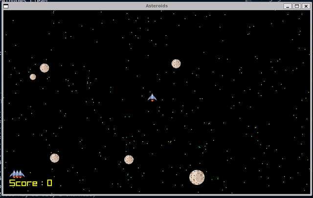

# Asteroids

A simple asteroids game written using C and raylib. 

## How to play

Control the spaceship with the arrow keys. Press the space bar to shoot and r to restart.
## Demo



## Steps to run

- Clone the repo

```bash
   git clone git@github.com:prudhvideep/spaceinvaders.git

   cd spaceinvaders/
```

- Run the game

```bash
   make run
```

- Port to wasm

   - Working on compiling the latest version with arena style memory management to wasm
   - The demo includes an older version.   


