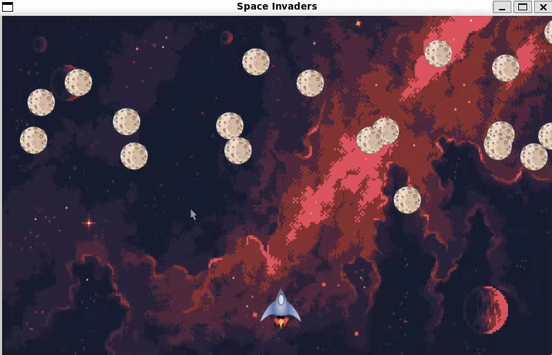

# Spaceinvaders

A simple asteroids game written using C and raylib. This project is a good starting point to learn how game loop work.

## How to play

Control the spaceship with the arrow keys. Press the space bar to shoot and r to restart.
## Demo



## Steps to run

- Clone the repo

```bash
   git clone git@github.com:prudhvideep/spaceinvaders.git

   cd spaceinvaders/
```

- Run the game

```bash
   make run
```


